# 🚴 Projet Pipeline de Données - Vélib' Paris
## Pipeline Kafka → Logstash → Elasticsearch → Kibana + Spark

[](https://www.elastic.co/)
[](https://kafka.apache.org/)
[](https://spark.apache.org/)

**Projet de Pipeline de Données Massives**  
*UE Indexation et Visualisation de Données Massives*

---

##  Table des Matières

- [Vue d'ensemble](#-vue-densemble)
- [Architecture](#-architecture)
- [Installation](#-installation)
- [Configuration](#-configuration)
- [Utilisation](#-utilisation)
- [Requêtes Elasticsearch](#-requêtes-elasticsearch)
- [Visualisations Kibana](#-visualisations-kibana)
- [Analyse Spark](#-analyse-spark)
- [Résultats](#-résultats)
- [Captures d'écran](#-captures-décran)
- [Livrables](#-livrables)
- [Auteurs](#-auteurs)

---

##  Vue d'ensemble

Ce projet implémente un **pipeline complet de traitement de données en temps réel** pour analyser la disponibilité des stations Vélib' à Paris.

### Objectifs du projet :
1.  Collecter des données en temps réel via l'API publique Vélib'
2.  Transmettre les données via Apache Kafka
3.  Transformer et indexer dans Elasticsearch avec Logstash
4.  Créer des visualisations interactives avec Kibana
5.  Effectuer des analyses avancées avec Apache Spark

###  Source de données : API Vélib' Métropole

- **Type** : API publique temps réel
- **Données** : 1400+ stations de vélos en partage à Paris
- **Fréquence** : Mise à jour toutes les 60 secondes
- **Pas de clé API requise** 
- **URL** : https://velib-metropole-opendata.smovengo.cloud/

**Pourquoi Vélib' ?**
- Données françaises pertinentes
- Cas d'usage concret (mobilité urbaine)
- Données géolocalisées riches
- Parfait pour des analyses temporelles et géographiques

---

## Architecture
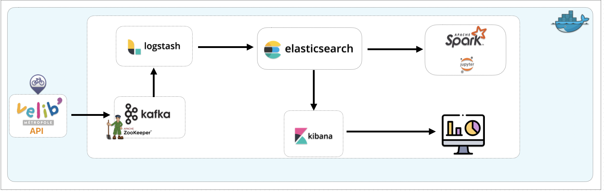


### Composants :

| Composant | Rôle | Port |
|-----------|------|------|
| **Kafka Producer** | Collecte données API Vélib' | - |
| **Zookeeper** | Coordination Kafka | 2181 |
| **Kafka** | Message broker | 9092 |
| **Logstash** | Transformation et enrichissement | 9600 |
| **Elasticsearch** | Stockage et indexation | 9200 |
| **Kibana** | Visualisation | 5601 |
| **Spark** | Analyse avancée | 8080, 7077 |

---

## 📁 Structure du Projet

```
projet-velib/
├── docker-compose.yml          # Orchestration des services
├── .env                        # Variables d'environnement
├── README.md                   # Ce fichier
│
├── kafka-producer/             # Collecteur de données API
│   ├── Dockerfile
│   ├── requirements.txt
│   └── producer.py             # Script Python collecteur
│
├── logstash/
│   ├── config/
│   │   └── logstash.yml        # Configuration Logstash
│   └── pipeline/
│       └── kafka-pipeline.conf # Pipeline de transformation
│
├── elasticsearch/
│   ├── config/
│   │   └── elasticsearch.yml
│   └── templates/
│       └── velib-mapping.json  # Mapping personnalisé avec analyzers
│
├── kibana/
│   └── config/
│       └── kibana.yml
│
├── spark/
│   ├── jobs/
│   │   └── process_velib_data.py  # Analyse Spark
│   └── output/                     # Résultats générés
│       ├── global_summary.json
│       ├── station_availability/
│       ├── hourly_patterns/
│       ├── period_analysis/
│       ├── bike_types_analysis/
│       └── problematic_stations/
│
└── docs/
    ├── elasticsearch-queries.json  # Les 5 requêtes obligatoires
    ├── screenshots/                # Captures d'écran
    └── rapport.pdf                 # Rapport final
```

---

##  Installation

### Prérequis

- Docker & Docker Compose
- 8 GB RAM minimum
- 10 GB espace disque

### 1️ Cloner le projet

```bash
git clone <votre-repo>
cd projet-velib
```

### 2️ Configurer les variables d'environnement

Créez un fichier `.env` :

```env
# Version Elastic Stack
ELASTIC_VERSION=8.11.0

# Mots de passe
ELASTIC_PASSWORD=changeme
KIBANA_SYSTEM_PASSWORD=changeme
LOGSTASH_INTERNAL_PASSWORD=changeme

# Configuration Kafka Producer
KAFKA_TOPIC=velib-data
FETCH_INTERVAL=60
```

### 3️ Augmenter la mémoire virtuelle (Linux/Mac)

```bash
sudo sysctl -w vm.max_map_count=262144

# Pour rendre permanent
echo "vm.max_map_count=262144" | sudo tee -a /etc/sysctl.conf
```

### 4️ Lancer le Setup Initial

```bash
# Setup des utilisateurs et rôles (première fois uniquement)
docker-compose --profile=setup up -d

# Attendre la fin du setup (environ 30 secondes)
docker-compose logs -f setup
```

### 5️ Lancer tous les services

```bash
docker-compose up -d

# Vérifier que tout fonctionne
docker-compose ps
```

### 6️ Vérifier les logs

```bash
# Logs du producteur Kafka
docker-compose logs -f kafka-producer

# Logs Logstash
docker-compose logs -f logstash

# Logs Elasticsearch
docker-compose logs -f elasticsearch
```

---

##  Configuration

###  Partie 1 : Collecte des Données (API Vélib')

Le producteur Kafka (`kafka-producer/producer.py`) :
- Interroge l'API Vélib' toutes les 60 secondes
- Récupère l'état de toutes les stations (~1400 stations)
- Enrichit les données avec :
  - Timestamp de collecte
  - Géolocalisation (latitude, longitude)
  - Taux d'occupation calculé
  - Nombre de vélos mécaniques et électriques
  - Statut de la station

**Exemple de données collectées :**
```json
{
  "station_id": "42345",
  "name": "Place de la Bastille",
  "latitude": 48.8532,
  "longitude": 2.3691,
  "num_bikes_available": 15,
  "mechanical_bikes": 10,
  "electric_bikes": 5,
  "num_docks_available": 25,
  "capacity": 40,
  "occupation_rate": 37.5,
  "station_status": "available",
  "collected_at": "2026-01-27T14:30:00Z"
}
```

###  Partie 2 : Transmission avec Kafka

**Topic Kafka** : `velib-data`
- **Partitions** : 3 (pour parallélisation)
- **Replication factor** : 1
- **Retention** : 7 jours

**Producteur** :
- Format : JSON
- Compression : Gzip
- Acks : all (garantie de livraison)

**Consommateur** :
- Groupe : `logstash-velib-consumer`
- Auto-offset : earliest (depuis le début)

###  Partie 3 : Transformation avec Logstash

Le pipeline Logstash (`logstash/pipeline/kafka-pipeline.conf`) effectue :

1. **Parsing des dates** : Conversion timestamps Unix
2. **Création geo_point** : Pour cartographie Kibana
3. **Calcul du statut** :
   - `empty` : Aucun vélo disponible
   - `full` : Aucune place disponible
   - `low` : Moins de 20% vélos
   - `almost_full` : Moins de 20% places
   - `available` : Normal

4. **Enrichissement temporel** :
   - Heure de la journée
   - Période (morning, lunch, afternoon, evening, night)

5. **Nettoyage** : Suppression champs inutiles

###  Mapping Elasticsearch Personnalisé

**Analyzers personnalisés** :
- **`station_name_analyzer`** : Tokenization FR, stopwords français
- **`ngram_analyzer`** : Pour recherche partielle (n-gram 3-4)
- **`autocomplete_analyzer`** : Edge n-gram pour autocomplétion

**Champs clés** :
- `location` : **geo_point** (pour cartes)
- `name.keyword` : Pour agrégations
- `name.ngram` : Pour recherche floue
- `@timestamp` : Série temporelle

**Index pattern** : `velib-data-YYYY.MM.dd` (rotation quotidienne)

---

##  Requêtes Elasticsearch

### Les 5 Requêtes Obligatoires

Toutes les requêtes sont dans `docs/elasticsearch-queries.json`.

#### 1️ Requête Textuelle

Recherche de stations contenant "Basilique" (requête validée avec résultats) :

```json
GET velib-data-*/_search
{
  "query": {
    "match": {
      "name": {
        "query": "Basilique",
        "operator": "and"
      }
    }
  },
  "size": 10
}
```

**Utilité** : Trouver des stations spécifiques par nom
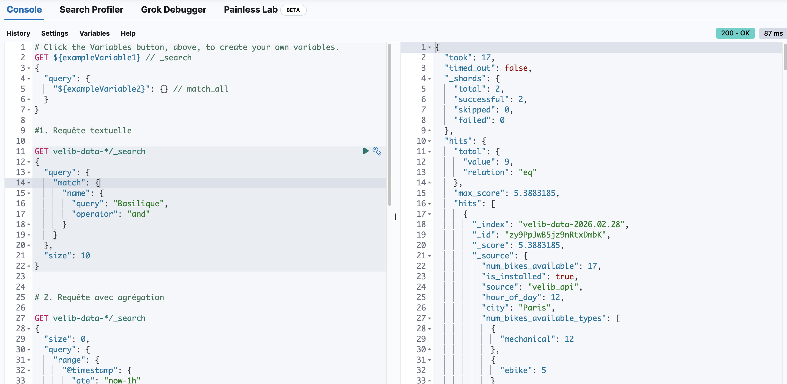

#### 2️ Requête avec Agrégation

Statistiques de disponibilité par statut de station :

```json
GET velib-data-*/_search
{
  "size": 0,
  "aggs": {
    "stats_par_statut": {
      "terms": {
        "field": "station_status"
      },
      "aggs": {
        "avg_bikes": {
          "avg": {
            "field": "num_bikes_available"
          }
        },
        "avg_occupation": {
          "avg": {
            "field": "occupation_rate"
          }
        }
      }
    }
  }
}
```

**Utilité** : Analyser la répartition des stations par état
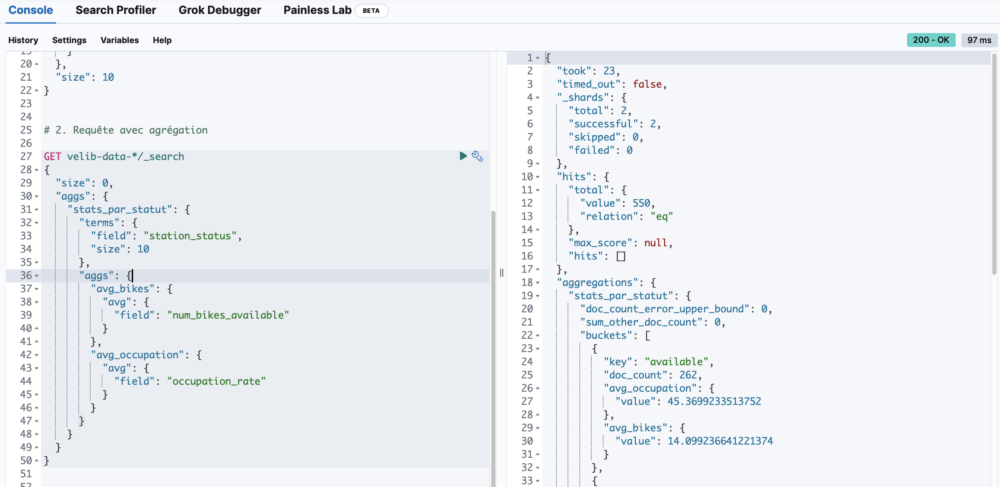

#### 3️ Requête N-gram

Recherche partielle sur nom de station (compatible mapping actuel) :

```json
GET velib-data-*/_search
{
  "query": {
    "match_phrase_prefix": {
      "name": "Bas"
    }
  },
  "size": 20,
  "_source": ["name", "num_bikes_available", "station_status"]
}
```

**Utilité** : Recherche partielle/autocomplétion sur le nom de station
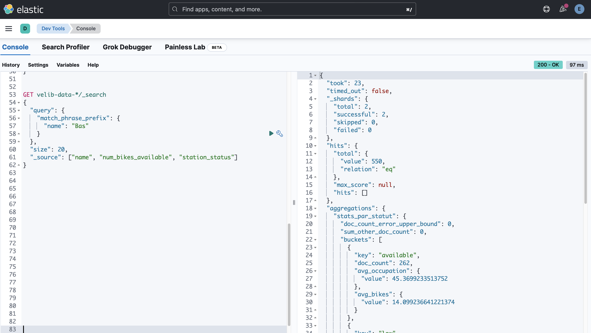

#### 4️ Requête Fuzzy (Floue)

Tolérance aux fautes de frappe :

```json
GET velib-data-*/_search
{
  "query": {
    "fuzzy": {
      "name": {
        "value": "Basiliqe",
        "fuzziness": "AUTO",
        "prefix_length": 1,
        "max_expansions": 50
      }
    }
  },
  "size": 10,
  "_source": ["name", "location", "num_bikes_available"]
}
```

**Utilité** : Tolérance aux fautes de frappe (ex: "Basiliqe" -> "Basilique")
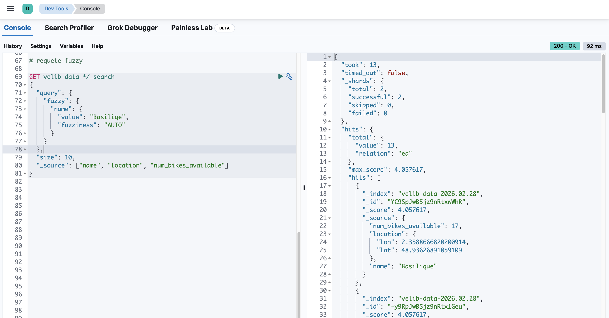

#### 5️ Série Temporelle

Évolution de la disponibilité sur 24h :

```json
GET velib-data-*/_search
{
  "size": 0,
  "query": {
    "range": {
      "@timestamp": {
        "gte": "now-24h",
        "lte": "now"
      }
    }
  },
  "aggs": {
    "disponibilite_temps": {
      "date_histogram": {
        "field": "@timestamp",
        "fixed_interval": "1h",
        "time_zone": "Europe/Paris",
        "min_doc_count": 0
      },
      "aggs": {
        "avg_bikes": {
          "avg": {
            "field": "num_bikes_available"
          }
        }
      }
    }
  }
}
```

**Utilité** : Analyser les patterns horaires d'utilisation
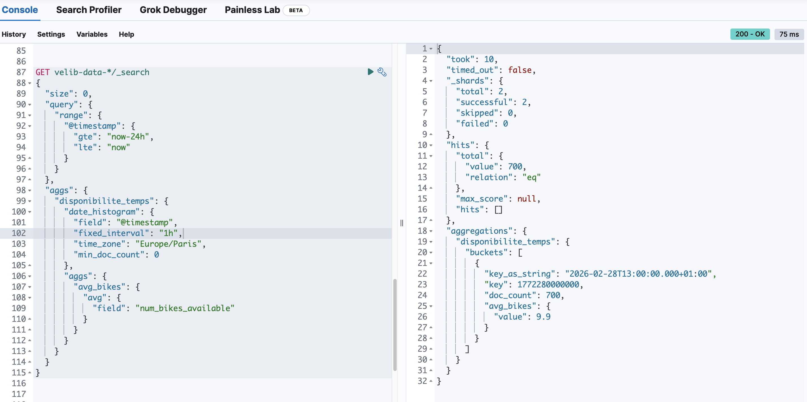

###  Requêtes Bonus

Le fichier `elasticsearch-queries.json` contient également :
- Recherche géospatiale (stations dans un rayon)
- Statistiques par période de la journée
- Top stations les plus utilisées
- Autocomplétion de nom de station

---

##  Visualisations Kibana

###  1. Index Pattern

**Création** :
1. Stack Management → Index Patterns → Create
2. Name : `velib-data-*`
3. Time field : `@timestamp`

###  2. Carte Géographique Interactive

**Type** : Maps  
**Données** : Toutes les stations Vélib' sur Paris

**Configuration** :
- Layer : Documents
- Geospatial field : `location` (geo_point)
- Style by value : `occupation_rate`
- Color ramp : Red (vide) → Green (plein)
- Tooltips : `name`, `num_bikes_available`, `station_status`

**Utilité** : Vue d'ensemble géographique en temps réel

###  3. Line Chart - Disponibilité dans le Temps

**Metrics** :
- Y-axis : Average `num_bikes_available`

**Buckets** :
- X-axis : Date Histogram, Interval 1h

**Utilité** : Identifier les heures de pointe

###  4. Metric - Taux d'Occupation Global

**Metric** : Average `occupation_rate`  
**Format** : Percentage

**Utilité** : KPI principal du système

###  5. Bar Chart - Top 15 Stations

**Metrics** : Average `num_bikes_available`  
**Buckets** : Terms on `name.keyword`, Top 15

**Utilité** : Stations les plus/moins fournies

###  6. Heatmap - Occupation par Période

**Metrics** : Average `occupation_rate`  
**Buckets** :
- Rows : Date Histogram (hourly)
- Columns : Terms `time_period`

**Utilité** : Patterns journaliers d'utilisation

###  7. Data Table - Stations Problématiques

**Filter** : `station_status : "empty"` OR `"full"`  
**Columns** : name, num_bikes_available, num_docks_available

**Utilité** : Identifier stations à rééquilibrer

###  8. Dashboard Global

**Nom** : "Dashboard Vélib' - Vue d'ensemble"

**Contient** :
- Carte géographique (grande)
- 3 métriques clés (vélos dispo, taux occupation, stations actives)
- Line chart temporel
- Top stations
- Heatmap périodes
- Table stations vides

**Filtres disponibles** :
- Time range
- Station status
- Time period
- Arrondissement

---

##  Analyse Spark

###  Objectif

Effectuer des analyses avancées impossibles en temps réel :
- Calculs statistiques complexes
- Identification de patterns
- Machine Learning (optionnel)

###  Analyses Réalisées

Le notebook `spark/notebooks/analyse_velib.ipynb` (et le script `spark/jobs/spark_processing.py`) génère :

#### 1. **Statistiques par Station**
- Disponibilité moyenne, min, max
- Nombre de fois vide/plein
- Ratio vélos mécaniques/électriques

**Output** : `station_availability/*.csv`

#### 2. **Patterns Horaires**
- Occupation par heure (0-23h)
- Identification heures de pointe
- Stations vides/pleines par heure

**Output** : `hourly_patterns/*.csv`

#### 3. **Analyse par Période**
- Statistiques matin/midi/après-midi/soir/nuit
- Taux d'occupation moyen par période

**Output** : `period_analysis/*.csv`

#### 4. **Types de Vélos**
- Répartition mécaniques vs électriques
- Stations avec plus d'électriques
- Ratio moyen par station

**Output** : `bike_types_analysis/*.csv`

#### 5. **Stations Problématiques**
- Taux de temps passé vide/plein
- Recommandations de rééquilibrage

**Output** : `problematic_stations/*.csv`

#### 6. **Résumé Global**
- Métriques agrégées
- Top stations
- Patterns journaliers

**Output** : `global_summary.json`

###  Exécution Spark

```bash
# Lancer Spark (si pas déjà fait)
docker compose up -d spark

# Ouvrir Jupyter Notebook Spark
# http://localhost:8888

# (Option batch) Exécuter le notebook en ligne de commande
docker compose exec -T spark jupyter nbconvert --to notebook --execute \
  /home/jovyan/work/analyse_velib.ipynb \
  --output /home/jovyan/work/analyse_velib.executed.ipynb
```

###  Spark UI

Interface web : http://localhost:4040

Permet de suivre :
- Jobs en cours
- Étapes d'exécution
- Performance
- Utilisation ressources

### Captures Notebook Spark

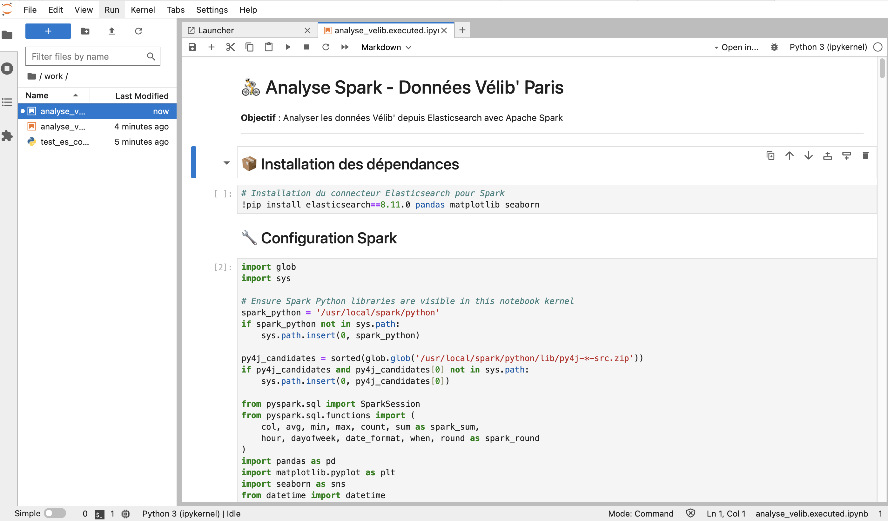
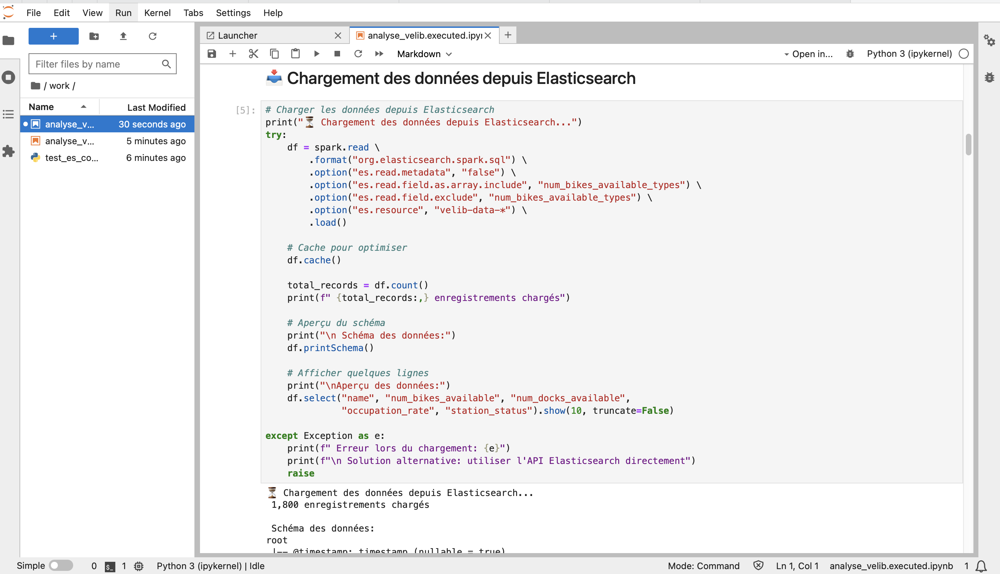
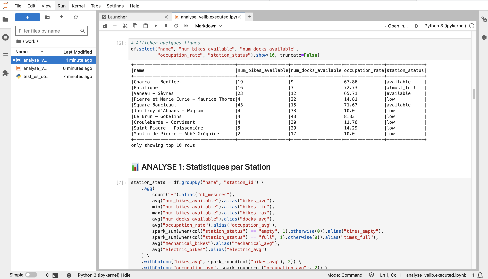

---

##  Résultats

###  Statistiques du Pipeline

- **Stations monitorées** : ~1400 stations
- **Fréquence collecte** : 60 secondes
- **Documents indexés/jour** : ~2 millions
- **Taille index/jour** : ~500 MB
- **Latence moyenne** : < 2 secondes (API → Kibana)

###  Insights Découverts

**Heures de pointe** :
- Matin : 8h-9h (stations vides en centre-ville)
- Soir : 18h-19h (stations pleines en centre-ville)

**Stations problématiques** :
- Top 10 souvent vides identifiées
- Top 10 souvent pleines identifiées
- Suggestions de rééquilibrage

**Vélos électriques** :
- Représentent ~30% du parc
- Plus demandés le matin

---

## 📸 Captures d'écran

Toutes les captures sont dans `docs/` :
### Le Dashboad global
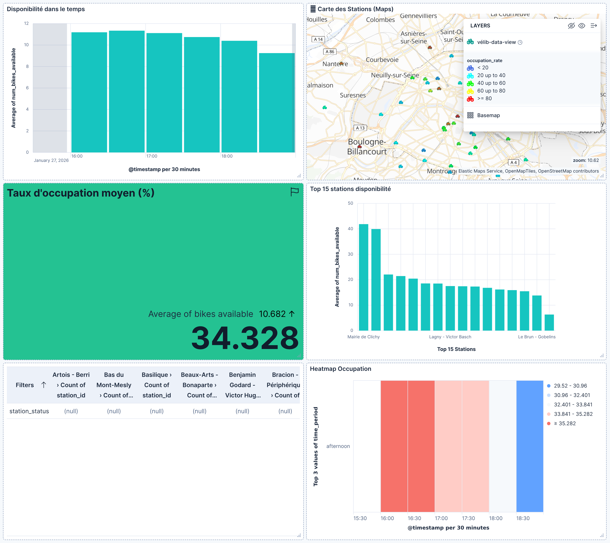

### Partie 1 : API & Kafka
- [ ] `01-api-velib-data.png` - Exemple données API
- [ ] `02-kafka-producer-logs.png` - Logs producteur
- [ ] `03-kafka-topics.png` - Liste des topics
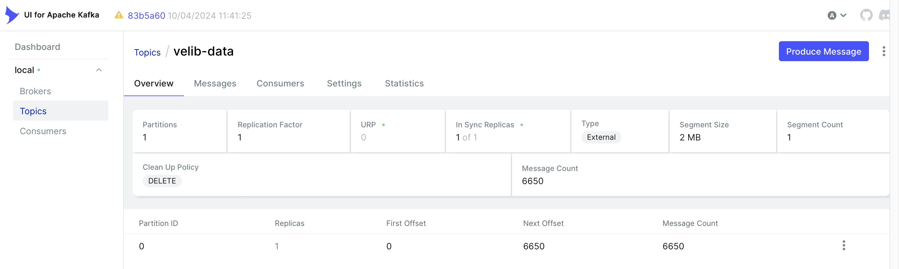
- [ ] `04-kafka-consumer.png` - Messages Kafka
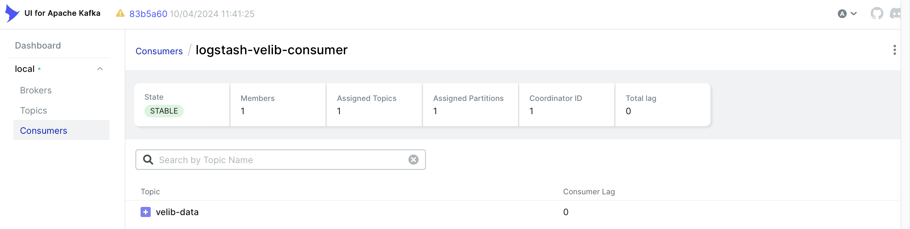


### Partie 2 : Logstash & Elasticsearch
- [ ] `05-logstash-pipeline.png` - Configuration pipeline
- [ ] `06-elasticsearch-mapping.png` - Mapping personnalisé
- [ ] `07-elasticsearch-index.png` - Index créé
- [ ] `08-elasticsearch-count.png` - Nombre de documents

### Partie 3 : Requêtes Elasticsearch
- [x] `requete_text.png` - Requête textuelle + résultats
- [x] `requete_agg.png` - Requête d'agrégation
- [x] `requete_ngram.png` - Requête de recherche partielle
- [x] `requete_fuzzy.png` - Requête floue
- [x] `requete_serie_temp.png` - Requête série temporelle

### Partie 4 : Kibana
- [ ] `14-index-pattern.png` - Index pattern créé
- [ ] `15-carte-velib.png` - Carte géographique
- [ ] `16-line-chart.png` - Disponibilité temporelle
- [ ] `17-metrics.png` - KPIs
- [ ] `18-heatmap.png` - Heatmap occupation
- [ ] `19-dashboard-complete.png` - Dashboard global
- [ ] `20-dashboard-filters.png` - Avec filtres appliqués

### Partie 5 : Spark
- [x] `spark_notebook.png` - Notebook d'analyse Spark
- [x] `spark_load_data_from_elasticsearch.png` - Chargement depuis Elasticsearch
- [x] `spark_afficher_lignes.png` - Aperçu des données
- [ ] `21-spark-ui.png` - Interface Spark UI (optionnel)
- [ ] `22-spark-execution.png` - Job en cours (optionnel)
- [ ] `23-spark-results-csv.png` - Fichiers CSV générés
- [ ] `24-spark-summary-json.png` - Résumé JSON


---

## Commandes Utiles

### Gestion des services

```bash
# Démarrer tout
docker-compose up -d

# Arrêter tout
docker-compose down

# Redémarrer un service
docker-compose restart logstash

# Voir les logs
docker-compose logs -f kafka-producer

# Arrêter et supprimer les volumes
docker-compose down -v
```

### Debugging

```bash
# Vérifier Elasticsearch
curl -u elastic:changeme http://localhost:9200/_cluster/health?pretty

# Compter les documents
curl -u elastic:changeme http://localhost:9200/velib-data-*/_count?pretty

# Vérifier les topics Kafka
docker exec kafka kafka-topics --list --bootstrap-server localhost:9092

# Consommer Kafka manuellement
docker exec kafka kafka-console-consumer \
  --bootstrap-server localhost:9092 \
  --topic velib-data \
  --from-beginning
```

### Export données

```bash
# Export dashboard Kibana
# Stack Management → Saved Objects → Export

# Export résultats Spark
docker cp spark-master:/opt/spark-jobs/output ./resultats/

# Export requêtes Elasticsearch
# Dev Tools → Copier les requêtes
```

---

##  Dépannage

### Elasticsearch ne démarre pas

```bash
sudo sysctl -w vm.max_map_count=262144
```

### Kafka Producer ne se connecte pas

Attendez 30 secondes après `docker-compose up` que Kafka soit prêt.

### Pas de données dans Elasticsearch

```bash
# Vérifier logs Logstash
docker-compose logs logstash | grep ERROR

# Vérifier logs Producer
docker-compose logs kafka-producer
```

### Spark échoue

Vérifiez que les credentials Elasticsearch sont corrects dans la commande spark-submit.

---

## Ressources

- [API Vélib' Documentation](https://www.velib-metropole.fr/donnees-open-data-gbfs-du-service-velib-metropole)
- [Elasticsearch Guide](https://www.elastic.co/guide/en/elasticsearch/reference/current/index.html)
- [Kafka Documentation](https://kafka.apache.org/documentation/)
- [Logstash Reference](https://www.elastic.co/guide/en/logstash/current/index.html)
- [Kibana Guide](https://www.elastic.co/guide/en/kibana/current/index.html)
- [Spark Documentation](https://spark.apache.org/docs/latest/)

---

## 👥 Auteurs

- **MBOUP El Hadji** -  el-hadji.mboup@ens.uvsq.fr
- **NDIAYE Pape Mor** - pape-mor.ndiaye@ens.uvsq.fr

**Encadrant** : Laure Bourgois  
**Formation** : M2 DATASCALE 
**Année universitaire** : 2025-2026

---

**Projet réalisé dans le cadre de l'UE Indexation et Visualisation de Données Massives**
